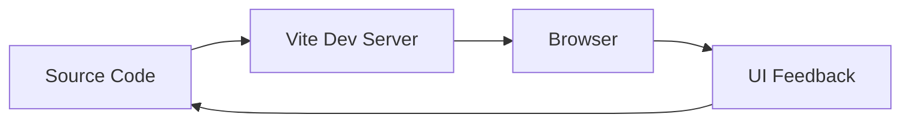

# 🤖 SFAIwala

<p align="center"></p>

<p align="center"><b>A modern Vite-based frontend project with a component-driven application structure.</b></p>

<p align="center">  </p>

## 🧠 Overview
SFAIwala is organized as a modern frontend application using Vite, with application code under `src/` and static/public assets under `public/`. The structure makes it straightforward to develop, preview and deploy as a web application.

## 📁 Structure
```text
sfaiwala/
├── public/          # Static public assets
├── src/             # Application components and logic
├── package.json     # Scripts and dependencies
├── package-lock.json
├── vite.config.js   # Vite configuration
└── README.md
```

## 🔄 Development Flow


## 🚀 Getting Started
```bash
git clone https://github.com/Abhishek7258/sfaiwala.git
cd sfaiwala
npm install
npm run dev
```

Build for production with the script defined in `package.json` (commonly `npm run build`) and preview the generated build using the project's preview script.

## 🎨 UI Documentation
For the best README presentation, add real screenshots from the running application under `docs/screenshots/`. Suggested views are desktop home, key feature/page, and mobile layout.

## 🧹 Code Quality
Use the linting script defined by `package.json` before opening a pull request. Keep components focused and avoid committing generated build output or local environment files.

## 🤝 Contributing
1. Create a feature branch.
2. Make focused changes.
3. Run lint/build checks.
4. Open a pull request with screenshots for UI changes.

## 📄 License
No license file is currently declared.